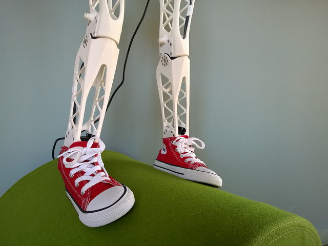
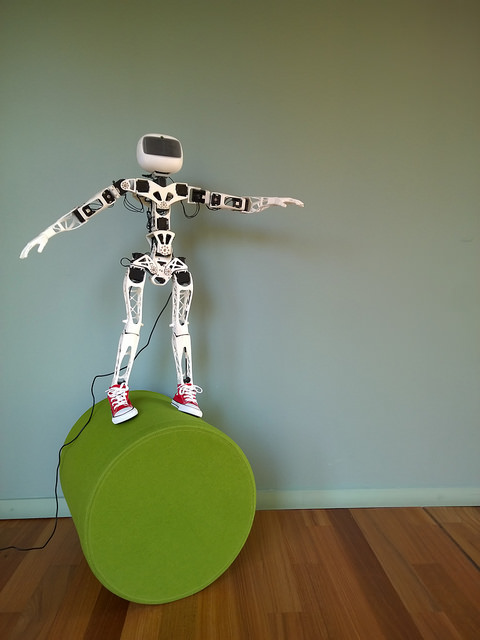

# humanoid-feet

I create a semi-passive bio-inspired humanoid foot during my last internship for my engineering school. The solution is semi-passive ankle (motor for the sagittal rotation and spring for the frontal rotation) in addition this foot has toes. The foot is human like foot,it respect the dimension of the 2 year old child and it is possible to put this foot into an shoes (size 23 EU). It is compatible with robotics motor MX28. I appreciate your comment and if you want to buy this model or information, please write me a email

Firs step with the solution and shoes : https://www.youtube.com/watch?v=ktuUdhnkk_w

 The hardware work is licensed under a <a rel="license" href="http://creativecommons.org/licenses/by-sa/4.0/">Creative Commons Attribution-ShareAlike 4.0 International License</a>.

### More on the project
- [Github-Poppy_humanoid] (Poppy_humanoid: https://github.com/poppy-project/poppy-humanoid.git)
- [Website](https://www.poppy-project.org)
- [Twitter](https://twitter.com/poppy_project)
- [Flickr](flickr.com/photos/poppy-project/)
- [Vimeo](https://vimeo.com/poppyproject)

